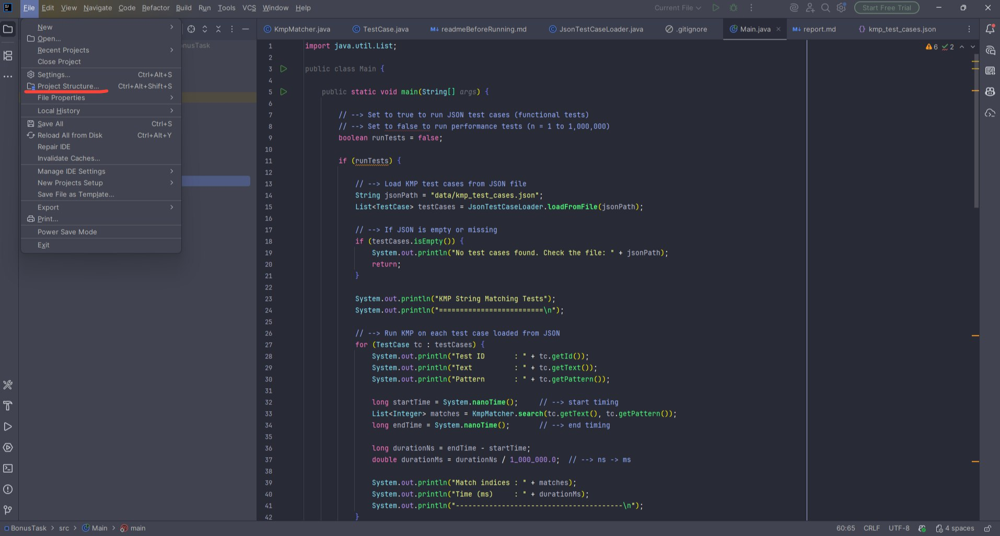
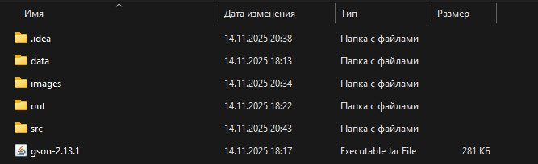

> ⚠ **Warning:**  
> Before running this project, you must manually install and add the **GSON** library to the classpath.  
> Otherwise, JSON loading will not work.

### The project root contains gson-2.13.1.jar. You'll need to install it into the library. In IntelliJ:File → Project Structure → Libraries → + → Java → select gson-2.13.1.jar → OK.

### you need to click to Project Structure -> Libraries -> + -> Java

### and select gson-2.13.1.jar and apply changes

