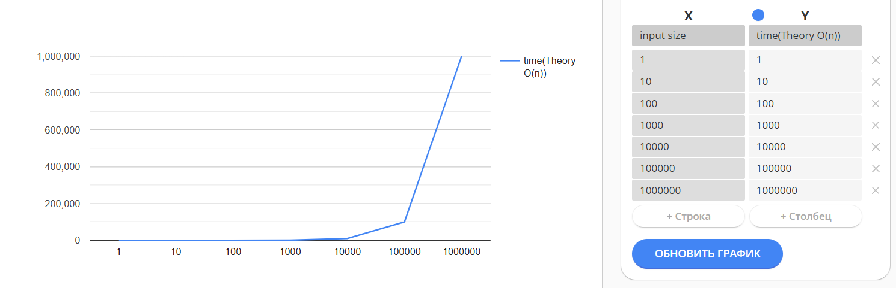
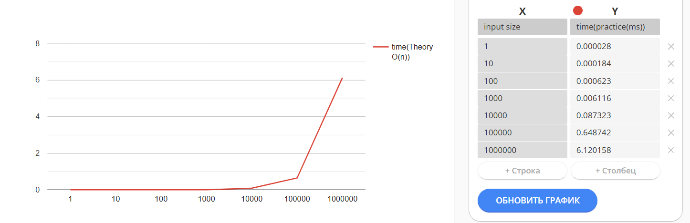

# Warning if you want to run the project, read readmeBeforeRunning.md

## KMP Algorithm — Description

The Knuth–Morris–Pratt (KMP) algorithm is an efficient string-searching method used to find occurrences of a pattern inside a text.  
Its main advantage is that it **never moves backward in the text** thanks to its preprocessing step.

KMP works in two stages:

1. **Preprocessing (LPS table)**  
   Before searching, KMP builds the LPS (Longest Prefix Suffix) array for the pattern.  
   The LPS array tells the algorithm how much it can shift the pattern when a mismatch happens,  
   without re-checking characters that are already known to match.

2. **Searching phase**  
   Using the LPS table, the algorithm scans the text in a single forward pass.  
   When characters match, pointers move forward; when they don't match, the pattern pointer jumps  
   to the correct position defined by the LPS array.

Thanks to this mechanism, KMP avoids redundant comparisons and achieves linear time performance.

**Key idea:**  
Instead of restarting the search after mismatch, KMP reuses previously matched information.

**Complexity**
- Preprocessing (LPS): `O(m)`
- Searching: `O(n)`
- Total: `O(n + m)`
- Space: `O(m)` for the LPS array

KMP is especially useful when the pattern contains repeated parts or when searching large texts.

## Theory and Practice: KMP

### 1. Theoretical Complexity (O(n))

KMP runs in linear time with respect to the text length **n**.  
This means:

- If n grows 10× → the running time should also grow ~10×
- If n grows 100× → the running time should grow ~100×

This is what “linear growth” means.


---

### 2. Practical Measurements (ms)
| n        | time (ms) |
|----------|-----------|
| 1        | 0.000028  |
| 10       | 0.000184  |
| 100      | 0.000623  |
| 1000     | 0.006116  |
| 10000    | 0.087323  |
| 100000   | 0.648742  |
| 1000000  | 6.120158  |


---

### 3. Normalized Results (time per character)

To check whether the growth is linear, we look at:

**time per character = time / n**

If KMP truly behaves like O(n),  
then **time per character** should remain almost the same for all n.

| n        | time (ms) | time / n (ms per character) |
|----------|-----------|------------------------------|
| 1        | 0.000028  | 0.000028000                  |
| 10       | 0.000184  | 0.000018400                  |
| 100      | 0.000623  | 0.000006230                  | 
| 1000     | 0.006116  | 0.000006116                  |
| 10000    | 0.087323  | 0.000008732                  |
| 100000   | 0.648742  | 0.000006487                  |
| 1000000  | 6.120158  | 0.000006120                  |


Sooo we can see in graphics:

Theory:


Practice:


So there is no noticeable difference between the practical measurements and the theoretical model. This confirms that the KMP algorithm indeed behaves as expected and follows linear time complexity.

---

### 4. Result

The practical measurements follow the expected linear trend:

- raw time increases proportionally to n
- time per character stays almost constant

This confirms that KMP behaves exactly as predicted by its  
**O(n)** theoretical time complexity.

Example output:
````
KMP Performance Tests (n = 1 to 1,000,000)
===========================================

n = 1
Text length          : 1
Pattern length       : 4
Match indices        : []
Avg time per run (ms): 0,000028
-----------------------------

n = 10
Text length          : 10
Pattern length       : 4
Match indices        : [6]
Avg time per run (ms): 0,000184
-----------------------------

n = 100
Text length          : 100
Pattern length       : 4
Match indices        : [96]
Avg time per run (ms): 0,000623
-----------------------------

n = 1000
Text length          : 1000
Pattern length       : 4
Match indices        : [996]
Avg time per run (ms): 0,006116
-----------------------------

n = 10000
Text length          : 10000
Pattern length       : 4
Match indices        : [9996]
Avg time per run (ms): 0,087323
-----------------------------

n = 100000
Text length          : 100000
Pattern length       : 4
Match indices        : [99996]
Avg time per run (ms): 0,648742
-----------------------------

n = 1000000
Text length          : 1000000
Pattern length       : 4
Match indices        : [999996]
Avg time per run (ms): 6,120158
-----------------------------
````